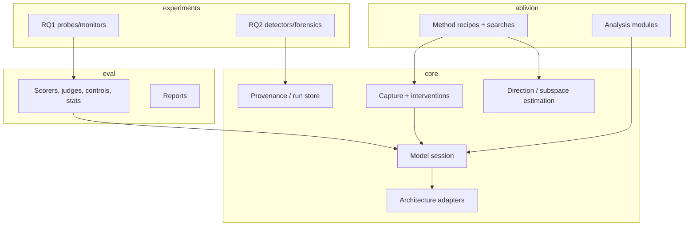
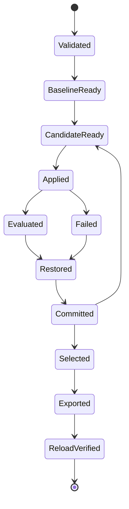

# Ablivion: a staged implementation guide

From an empty repository to a tested platform for measuring, monitoring, and detecting refusal removal in language models

**Version:** 2.2 · **Reference review:** 23 September 2026 · **Source audit of OBLITERATUS and Heretic:** 24 September 2026 (§17) · **Working names:** shared core (unnamed), Ablivion (abliteration tool), evaluation harness, Baku (later)

**Changes in 2.1:** namespaced import and command names (`abeval`, not `eval`); tied-embedding handling; Stage A4 reduced to a fixed-strength edit, with search moved to Phase C; RQ1 and RQ2 pilots aligned with Section 2 (controls, overlap regression, stop conditions, functional validation instead of restoration); runtime versus bias-baked steering separated for RQ2; a scale-free, within-family null for the detector; a parked-work section; report requirements trimmed to research needs; references renumbered, split, and marked where unverified.

**Changes in 2.2:** results of a source-level audit of OBLITERATUS (`b847511`) and Heretic (`3521f86`), restated as specifications (§9, §17). RQ1 gains its position against prior work (R4), two capture positions, extraction position as an experimental factor, transferred-versus-retrained probes, an independent refusal probe, a multi-direction confound control, and a named deployer. RQ2's detector becomes a battery: per-matrix tests, per-layer writer and reader tests, an embedding test, a row-norm correction, approximate-null calibration, rank estimation, cross-layer smoothness, reflection as a declared case, and same-base negatives. Phase C gains a building-blocks map, restated reference specifications, an operator-level slice list with three distinct norm-preservation operators, and a labs track (Phase C′). References are pinned and extended. §17 records every audited technique's disposition: folded in, lab, reading list, or shelved. Suspected reference issues seed `DISCREPANCIES.md`.

This is an implementation blueprint, not a completed implementation or a report of measured results. All proposed commands, paths, schemas, and acceptance thresholds below belong to the software you will build. No model experiments were run while preparing this guide. Reference tools, papers, and their claims were inspected on the review date; pin every source and model revision when implementation begins.

## 1. What this project is, and what "good" means

The deliverable is a research platform in four parts, plus a fifth that comes later:

- **The core** — a library for model internals: model sessions, architecture adapters, activation capture, direction and subspace estimation, reversible interventions, and run provenance. It provides *mechanism* and holds no opinion about refusal, abliteration, or any experiment.
- **The evaluation harness** — a measurement library that scores any model or edit on held-out behavior, capability, and internal signals, against matched controls, with uncertainty. It is independent of any editing tool so it can evaluate other tools' outputs as black boxes, and it doubles as the behavioral-equivalence instrument for reimplementation.
- **Ablivion** — the abliteration tool: method recipes, searches, analysis modules, and CLI, built on the core. It includes independent reimplementations of reference methods that are *functionally equivalent* to the originals, not textually similar.
- **Research experiments** — the studies that answer the two research questions in Section 2, using all three libraries.
- **Baku (later)** — an interpretability-native red-teaming tool on the same core and harness. Out of scope for this guide; the architecture keeps room for it.

This is a research instrument, and its public artifacts are code, evaluation harnesses, analyses, and detection tools — not a better uncensoring product. By default the project does not publish edited weights (Section 3). The abliteration methods exist here as the *interventions we measure* and the *attack suite for the monitoring and forensics experiments*.

### What counts as success

Three kinds of evidence, tracked separately (Section 12):

1. **Software correctness** — mathematical invariants, component tests, and end-to-end runs pass; edits are reversible; exports reload.
2. **Behavioral equivalence** — a reimplemented method matches its reference within predeclared tolerances at each comparison level, and every divergence is adjudicated and logged.
3. **Research validity** — the experiments answer their questions with controls, held-out data, and honest uncertainty. A correct implementation can produce a negative result; that is a finding, not a failure.

Feature parity with an existing tool is not, by itself, any of these. The contribution is the rigor of the measurement and the answers to the research questions. An independent, verified reimplementation that documents where it differs from the original is a credible artifact on its own.

### Anti-goals

Write these down so that scope creep has something explicit to fail against. Effort spent here is effort lost:

- **More effective refusal removal than existing tools.** Methods are reimplemented to be studied, not improved.
- **Broader architecture coverage.** Reference tools already claim wide coverage; a support matrix is not a finding.
- **Product surface:** chat playgrounds, A/B interfaces, hub-push export, leaderboards, telemetry.
- **Published edited checkpoints** (Section 3).

When a proposed piece of work serves neither research question, nor the platform they depend on, nor the learning goal, cut it.

## 2. Research questions

Both are preregistered here in their authoritative form. The collaborator prompt (`AGENTS.md`) carries a short version; if the two differ, this guide wins.

**RQ1 — Does harmfulness survive abliteration, and does a harmfulness monitor survive with it?**
Prior work finds that harmfulness and refusal are encoded as *separate* concepts in LLM activations, with distinct directions; steering along the refusal direction elicits refusal without reversing the model's internal judgment of harmfulness. [R4] The same work reports that adversarial fine-tuning barely moves the internal harmfulness judgment, and that a monitor built on it (Latent Guard) is robust to fine-tuning attacks. What remains open is abliteration by *weight editing*, how the answer varies across removal operators, and the mechanism. Related: a cross-family reproducibility study of latent safety probes [R29], and evidence that harmfulness spans many directions rather than one [R30]. The question: after abliteration, does the internal harmfulness representation persist, and does a monitor built on it keep detecting harmful requests while a refusal-direction monitor goes blind? And how does this vary across removal methods (single-direction, multi-direction SVD, whitened, norm-preserving, reflection, steering)? A method that removes more of the harmfulness signal is, from a control standpoint, more dangerous even at equal refusal reduction.

- **Primary measure:** detection AUC of a harmfulness probe on the edited model vs. a refusal-direction probe, across methods, on held-out harmful/benign prompts.
- **Capture positions:** R4 finds harmfulness encoded mainly at `t_inst` (the last token of the user instruction) and refusal at `t_post-inst` (the last token of the post-instruction template). The harmfulness probe reads `t_inst`; the refusal probe reads `t_post-inst`. Capture both for every prompt.
- **Extraction position as a factor (hypothesis).** Reference methods differ in where they estimate the direction they remove. OBLITERATUS's `basic` preset tokenizes raw prompts without the chat template, so its last token is `t_inst`; its templated presets and Heretic estimate at `t_post-inst` (§9, reference specifications). Prediction: directions estimated at `t_inst` overlap more with the harmfulness probe, and edits built from them degrade the harmfulness monitor more at matched refusal reduction. Vary position with everything else fixed.
- **Mechanistic prediction:** probe degradation should be predicted by geometric overlap with the removed subspace. For a probe with weight vector `w` and removed orthonormal basis `U`, degradation should increase with `‖Uᵀw‖ / ‖w‖`. At an edited layer this is partly algebra: a probe transferred from the base reads `wᵀPx = (Pw)ᵀx`. The finding lies elsewhere: (a) at layers downstream of the last edit, where self-repair can restore the signal [R5, R35]; and (b) in the gap between a probe *transferred* from the base and one *retrained* on edited activations. "Harmfulness survives" means the retrained probe still separates; "the monitor survives" means the transferred probe still does. Report both.
- **Multi-direction confound.** SVD directions beyond the first, estimated from index-paired uncentered differences as the reference does, carry within-group prompt variance that may include harmfulness itself. Record each removed direction's overlap with the harmfulness probe, and run a pairing-permutation control: re-pair harmful and harmless prompts at random, re-estimate, and compare subspaces by principal angles.
- **Controls:** unedited model; identity edit; probes trained/evaluated on disjoint splits; matched random-direction monitors. Add one control the obvious design omits: an edit along an *unrelated* direction matched on measured weight-change norm. Any probe transferred from base to edited activations faces distribution shift regardless of what was removed, and without this control the whole result is confounded by it. The refusal probe must be estimated *independently* of the removed direction (disjoint data, and a different layer or estimator), or its blindness is guaranteed by construction.
- **Dissociating the two signals:** harmfulness and refusal only come apart under a task that pulls them apart — instructing the model to comply with harmful requests and decline harmless ones, so the internal judgment and the behavioral decision disagree. [R4] Verify in the pilot that this task works on your model before scaling; if the two probes are collinear on your checkpoint, the experiment has no contrast to measure.
- **Threat model.** The deployer is a platform that serves community checkpoints derived from a base it knows (a model host or inference provider) and runs a monitor fit on the base model's activations. Measure both the monitor transferred unchanged and the monitor refit on the served checkpoint.
- **What it would establish / not establish:** evidence about where each method's damage lands, on the tested models and probe families only — not a general safety guarantee. It concerns monitoring models *you serve*; it constrains nothing about what someone runs locally with the monitor removed. State that limit in the paper rather than letting a reviewer find it.

**RQ2 — Can weight-level abliteration be detected, and the removed direction recovered, from the edited weights?**
Full directional ablation applies a shared rank-one change to every residual-writing matrix: `W' = (I − û ûᵀ) W`, i.e. `W' = W − û (ûᵀ W)`. Every edited matrix loses its component along one output direction `û`. With the base model this is easy to detect (a low-rank difference sharing one left-singular vector); the research question is detection **without** the base, and robustness of both detection and direction recovery across the edit variants real tools produce.

**Edit signatures of the reference tools** (restated from the source audit, §9 and §17; confirm each by running the pinned tool on a fixture before relying on it):

| Variant | Residual writers (`o_proj`, `down_proj`) | Residual readers (`q/k/v/gate/up`) | Output head / embedding | Direction | Exactness |
|---|---|---|---|---|---|
| OBLITERATUS `basic` | `(I − ddᵀ)W`: exact left null `d` | `W(I − ddᵀ)`: exact right null `d` (default target `all`) | Head projected with the last selected layer's direction at full strength; on a tied checkpoint this edits the input embedding too | Own direction per selected layer | Exact |
| OBLITERATUS `advanced` | k = 4, strength ≈ 0.7 varied per layer, then one scalar per matrix restoring the Frobenius norm (capped at 1.10) | Same operator | As above, with the k-direction subspace | Per layer | Residual `(1 − s)` along each direction; one effective pass |
| OBLITERATUS `aggressive` | Whitened SVD, k = 8, full strength, up to 3 re-probed passes | Same | As above | Per layer | Cumulative rank up to 24 per layer |
| OBLITERATUS `inverted` / `nuclear` | `I − s·ddᵀ` with s = 2 (reflection) / s = 1.25 | Same | Reflected | Per layer | s = 2 is orthogonal: no null; s = 1.25 leaves −0.25 |
| Heretic (defaults) | Per-row renormalization (grimjim) of the projected matrix, with the change approximated at rank 3; direction orthogonalized against the harmless mean; strength follows a kernel over layers | Not edited | Not edited | Global (fractional layer index) or per layer | Approximate null |

- **Other variants to separate:** full vs. partial strength; single vs. multi-direction with unknown rank; partial layer coverage (the OBLITERATUS default edits a knee/COSMIC-selected subset); steering baked into the weights as a bias on a residual-writing path — only on a model that already has such biases, because adding a tensor the architecture lacks (Qwen3-4B has none) is trivially detectable from the parameter list; and ordinary fine-tuning as the negative class the detector must not flag. Runtime steering is out of scope for weight forensics: it leaves the weights identical to the base, so as a test case it is simply the clean model again.

**Candidate no-base detector: a battery, stated concretely enough to falsify.** Orient every matrix so the residual dimension is explicit: writers have it as the output (row) dimension, readers as the input (column) dimension, and the embedding matrix as its column dimension. A tied input/output embedding is one matrix; count it once. Use scale-free statistics throughout (a matrix's smallest singular value relative to its second-smallest or its median), and a null distribution estimated from clean models of the same family that the detector has never seen.

1. **Per-matrix test.** For each writer, the smallest *left* singular value; for each reader, the smallest *right* singular value. Count matrices whose statistic falls below the null. Any projection that leaves an exact or near-exact null vector in a matrix trips this test, whether or not the vector is shared with other matrices.
2. **Per-layer shared null.** Within layer ℓ, accumulate `G_ℓ^W = Σ Ŵ Ŵᵀ` over normalized writers and `G_ℓ^R = Σ Ŵᵀ Ŵ` over normalized readers (each `d_model × d_model`, so cheap). Under writer+reader projection with one direction per layer, five readers and two writers share `d`. Examine the smallest `k` eigenvalues, and check that the writer-side and reader-side null vectors agree. Do not assume a direction shared across layers: OBLITERATUS estimates one per layer.
3. **Embedding test.** Projecting the head of a tied checkpoint makes every embedding row orthogonal to `d`, so `d` is a right null vector of the embedding matrix. The matrix is large (151,936 × 2560 on Qwen3-4B), so the statistic is strong, and it ties the direction to the last edited layer.
4. **Cross-layer smoothness.** Recovered per-layer directions from adjacent layers should agree in absolute cosine more than clean-model null vectors do. For partial coverage, also compute the per-layer statistics over sliding windows.
5. **Rank estimation.** Estimate `k` from the eigenvalue gap; never assume it. Real ranks run from 1 (`basic`) to 4 (`advanced`) to up to 24 (`aggressive`, re-probed passes).

Complications to handle rather than assume away:

- **Partial strength.** `W′ = (I − α û ûᵀ) W` gives `ûᵀW′ = (1−α) ûᵀW`, so the eigenvalue is scaled by `(1−α)²` rather than zeroed. The signature is an anomalously small eigenvalue, not a zero, which is exactly why the null distribution is load-bearing. `nuclear`'s s = 1.25 is this case, with factor 0.0625.
- **Three norm-preservation operators, three signatures.** (a) One scalar per matrix (OBLITERATUS) leaves the null vector exactly where it was. (b) Per-row renormalization (grimjim [R7], Heretic) gives `W′ = M N⁻¹ (I − α ûûᵀ) M⁻¹ W`, where `M` holds the original row norms and `N` the renormalization. Its left null vector is `∝ N M⁻¹ û`: each matrix still has one, but they differ across matrices. Because row norms are preserved by construction, `M` can be read from `W′`; rescale each recovered null vector by `M` before comparing across matrices. `N ≈ I` is expected when `û` is spread across dimensions but not when it concentrates on outlier dimensions; test that assumption. (c) Column rescaling `W′D` preserves the left null vector.
- **Approximate nulls.** Heretic exports a rank-3 approximation of its per-row-renormalized change, so the null vector is only approximate. Calibrate the per-matrix test on Heretic-style edits you produce, where the truncation error is known.
- **Reflection.** `I − 2ûûᵀ` is orthogonal, so it leaves every singular value and eigenvalue unchanged: the whole spectral battery is blind to it. A candidate non-spectral signal, not yet derived: when only some layers are reflected, the sign of the `û` component written by reflected layers disagrees with what unreflected downstream readers expect. If no signal is found, report reflection as a declared limit of weight-only detection.
- **Concept-localized edits.** Steering edits that localize to a small number of residual dimensions are described in the literature as hard to detect; include them as a hard negative if you can construct them. [R11]
- **Anisotropy and scale.** Clean models do not write to the residual stream evenly, so some eigenvalues are naturally small, and raw values shift with model width, depth, and the number of matrices. Hence the scale-free statistics and a within-family null. A detector calibrated across mixed families risks learning to flag families instead of edits. Random-matrix theory (the Marchenko–Pastur noise floor, the BBP detection threshold) [R38] is a candidate source of an analytical null to compare with the empirical one.
- **Base-identity confound.** If every positive is an edit of Qwen3-4B and most negatives are other models, a detector can learn "derived from Qwen3-4B." Draw negatives from the same base: its fine-tunes and merged LoRA fine-tunes.

**Negatives and evasions.** Negatives: clean same-family models; fine-tunes and merged LoRA fine-tunes of the same base; fine-tuned uncensored models. Merged LoRA fine-tunes matter doubly, because a low-rank difference from the base is also what the *with-base* detector looks for, and Heretic's per-matrix change is itself rank ≤ 3. The with-base detector must therefore require a shared singular vector, not low rank alone. Evasions to test as positives: abliterate-then-heal (fine-tuning after the edit, which can fill the null direction) and deliberate small noise added into the null space, which trades detectability against damage.

**What the detector detects.** The battery flags any projection along a shared direction, not refusal removal specifically. Attributing a detection to refusal rests on functional validation (§10). Say so wherever detection results are reported.

- **What it would establish / not establish:** whether these edits leave a weight-space fingerprint on the tested families — a tamper-detection result, adjacent to model provenance and supply-chain integrity — not a universal detector. Norm-preserving, approximate, partial, and reflected variants are expected to blur or remove the signal; quantifying that is part of the contribution.

**Recovery, scoped honestly.** Recovery means identifying the removed direction and attributing the edit, not restoring the model. Projection is rank-deficient and destroys `ûᵀW`; that information is not in the edited weights, so re-adding a direction does not reconstruct the original matrix and should not be described as restoration. Score recovery as `|cos(û_detected, û_true)|` on edits you produced, per layer when directions are per layer, and for third-party checkpoints compare against a refusal direction estimated on the matched base. The defensive payoff is detection, identification, and attribution.

**Prior work.** An activation-based scanner, AMS [R26], detects safety-training modification from activation geometry (71% leave-one-out accuracy over 14 configurations) and names behavioral fine-tuning as a class it cannot detect; it is the closest related work and needs a comparison. OBLITERATUS's spectral certification module applies random-matrix thresholds to post-edit *activations* to judge whether refusal removal is complete; it does not detect edits. The source audit found no weight-level abliteration detector in either reference tool, and searches on the review dates surfaced no prior weight-only work. Confirm this in a proper related-work pass before claiming novelty.

## 3. Handling norms and safety scope

These norms are requirements, not preferences, and several stages enforce them in code.

- **Prompts:** harmful-request prompts come from established research datasets (e.g. the AdvBench-derived sets these tools use, HarmBench, StrongREJECT, XSTest for benign overrefusal) or from sets constructed under these norms. [R15, R17, R16, R18] Model responses live only in local run artifacts.
- **Outputs are untrusted data:** escape all model text in reports; never render it as markup or execute it. Judges receive model responses as data, never as instructions.
- **No weights published by default:** public releases center on code, harnesses, analyses, and detection tools. Publishing any edited checkpoint is a separate, deliberate decision with its own review — and, if this becomes lab work, its own institutional release review. Confirm early how that review treats a safeguard-removal tool.
- **Reference tools run isolated:** with telemetry and uploads disabled (some tools enable telemetry by default in hosted settings). [R21]
- **Teaching materials** (Section 13) include harmful output only when an example is necessary, and then redacted or summarized; synthetic examples are labeled synthetic.

## 4. Architecture: a thin core, tools on top

Begin with a Python workspace of separate installable packages sharing a lockfile. Suggested dependencies: PyTorch, Transformers, safetensors, a typed-config library, a CLI library, pytest, and an optimizer such as Optuna (Ablivion only). Add PEFT, a benchmark harness, and plotting/report libraries when their stages require them. Freeze versions from your chosen baseline environment, not a floating latest install.

```
packages/
  core/          import abl_core          mechanism: sessions, adapters, capture, directions, interventions, provenance
  eval/          import abl_eval          measurement: splits, judges, capability tasks, controls, statistics, reports
  ablivion/      import ablivion          policy: method recipes, searches, analysis modules, CLI
  experiments/   import abl_experiments   RQ1 and RQ2: preregistrations, probes, detectors, analyses
  baku/          later, on core + eval
tests/           unit / integration / e2e, per package
```

### Settle before Stage A0

- **Import and command names.** In this guide, `core`, `eval`, and `experiments` name the *packages*; their import names are namespaced as shown above. Never use `core` or `eval` as an import name or a command. `eval` is a shell builtin, so a console script named `eval` is shadowed — typing `eval baseline ...` runs the builtin, which tries to execute `baseline` as a command. As a Python package name, `eval` shadows the builtin wherever it is imported, and `core` collides with other installed packages. The import names above are working names. The core deserves a neutral name of its own, because Baku and later tools will depend on it; choose it now, since renaming after the first imports is expensive. Commands: `ablivion`, `abeval`, `abx`.
- **License.** Choose the repository license before writing code, with Section 9's specification-not-source rule in mind.
- **Tied parameters.** Check whether the pinned checkpoint ties its input and output embeddings (`tie_word_embeddings` in the model config). Qwen3-4B-Instruct-2507 does: its `main` config, read 24 September 2026, sets `tie_word_embeddings: true` and `attention_bias: false`; re-check at the pinned revision. The adapter records the tie (Stage A1), an embedding or head edit changes both (Stage A3), and RQ2 counts the matrix once. Reference tools can edit a tied head silently (`DISCREPANCIES.md`, D3).

### The dependency rule

`eval`, `ablivion`, `experiments`, and `baku` may depend on `core`. **`core` imports from none of them.** `eval` does not import `ablivion`. Enforce this with an import-contract checker (e.g. import-linter) in CI so the boundaries survive tired commits.

- **Core = mechanism, tools = policy.** The core knows *how* to load, capture, estimate, intervene, restore, and record. Which methods, which directions, which objective, which fitness function, which experiment design — all policy, all in the tools.
- **Promote, don't predict.** Code enters the core when a *second* consumer needs it or when it is plainly a shared primitive. Until Baku exists, anything only Ablivion uses stays in Ablivion. Speculative generality in the core is the failure mode that makes every tool harder to change; this rule is the guard against it.
- **The harness stays tool-agnostic.** It scores a model or an edit given a plan and data. It must be able to evaluate Heretic's or OBLITERATUS's output with no knowledge of how they produced it.



### Contracts to settle before extending the system

These live in `core` (mechanism) and `eval` (measurement). Similar names do not establish mathematical equivalence; a capture site, an activation-intervention site, and a weight-edit target are distinct.

| Contract | Package | Inputs → outputs | Required invariant |
|---|---|---|---|
| `ModelAdapter` | core | model config → named sites and capabilities | Every site declares semantics, shape, layout, residual-write role |
| `ModelSession` | core | prepared inputs → logits, outputs, optional captures | Generation settings recorded; trials cannot contaminate one another |
| `PromptRecord` | core | ID, messages, category, family, split, media | IDs and family memberships survive every transformation |
| `CaptureSpec` | core | site IDs, semantic position policy, aggregation | Padding and absent positions handled explicitly |
| `ActivationBatch` | core | IDs, site ID, positions, values, masks | Batch order reconstructable; tensor axes documented |
| `DirectionEstimate` | core | fit-data identity → vectors/bases + diagnostics | Model, site, template, estimator, sign convention, fit IDs attached |
| `InterventionPlan` | core | sites, method, strength, tensors, base identity | Serializable, immutable, validated before changing state |
| `AppliedIntervention` | core | plan + session → temporary behavior | Cleanup on success, exception, and cancellation |
| `Scorer` | eval | prompt + response/context → per-example record | Invalid, failed, truncated, unjudged cases explicit |
| `Monitor` | eval | model + probe spec → per-example score | Train/eval split identity recorded; never fit on eval data |
| `Control` | eval | a target intervention → matched comparison intervention | Matching criteria (sites, strength, rank, norm) recorded |
| `SearchPolicy` | ablivion | validation metrics + budget → candidates | Never receives final-test records |
| `RunStore` | core | versioned records and tensor shards | Completed records durable; partial records cannot masquerade as complete |
| `ReportBuilder` | eval | saved run bundle → human-readable artifacts | Displayed claims trace to exact observations |

Use a site descriptor with: stable ID, module/parameter path, block index, semantic kind, input/output shape, residual dimension, tensor orientation, bias treatment, expert axis if any, modality, and supported operations.

### Trial lifecycle (unchanged from a correct editing pipeline)



If restoration fails, mark the session poisoned and reload the base before continuing. Recompute caches after edits: KV or recurrent state created under one intervention must not be reused under another.

### Proposed CLI surfaces

Interface targets for the packages, not commands to run today. Each subcommand calls the same application services its tests do.

```bash
# abeval (tool-agnostic): score any model or edited checkpoint
abeval baseline  --config configs/eval.toml --model <hf-id-or-path> --output runs/base
abeval score     --config configs/eval.toml --model <path> --split validation --output runs/x
abeval monitor   --config configs/eval.toml --model <path> --probe refusal|harmfulness --output runs/m
abeval report    --run runs/x
abeval compare   --runs runs/base runs/x

# ablivion: produce an edit, using core + its own method recipes
ablivion doctor  --config configs/ablivion.toml
ablivion inspect --config configs/ablivion.toml
ablivion capture --config configs/ablivion.toml --output runs/capture
ablivion edit    --config configs/ablivion.toml --method <recipe> --output exports/candidate
ablivion search  --config configs/ablivion.toml --output runs/experiment      # arrives in Phase C, slice 4
ablivion verify-export --export exports/candidate

# reimplementation equivalence harness
ablivion parity  --reference-artifacts refs/obliteratus/<run> --ours runs/x --level tokens|acts|dirs|weights|behavior

# abx: research experiments
abx rq1 probe-transfer --config experiments/rq1_harmfulness/config.toml
abx rq2 detect         --model <path-or-id> [--base <path-or-id>]
```

`ablivion search` fits and selects on development data and never opens final-test data; `abeval score --split final_test` records that the frozen test was accessed; `report` is a pure artifact transformation; `verify-export` runs in a fresh process.

Configuration is organized around the contracts, with placeholders that fail validation until resolved:

```toml
# configs/ablivion.toml — proposed shape; resolve identities in the first stage.
schema_version = 1

[model]
id = "Qwen/Qwen3-4B-Instruct-2507"      # dense, non-thinking; matches the paper's checkpoint if same revision
revision = "RESOLVE_AND_PIN"
architecture_adapter = "qwen3_dense_v1"
representation = "bf16"

[data]
manifest = "data/splits.json"           # fit / validation / final_test roles, family-grouped

[capture]
boundary = "REFERENCE_BOUNDARY_TO_VERIFY"
positions = ["t_inst", "t_post_inst"]   # R4: harmfulness at t_inst, refusal at t_post_inst
direction_position = "t_post_inst"      # where the removed direction is estimated; an RQ1 factor
max_seq_length = 256                     # always explicit; never adapted to free memory

[method]
id = "diffmeans_v1"                      # one recipe; reference methods reimplemented as separate recipes
settings_file = "configs/methods/diffmeans.json"

[search]                                 # used from Phase C, slice 4
seed = 0
workers = 1
budget_file = "configs/budget.json"

[eval]
protocol = "configs/eval.json"

[artifacts]
retain_responses = true
retain_full_activations = false
```

## 5. Experimental data and run artifacts

Create three nonoverlapping **roles**, independent of source-dataset split names: `fit` estimates directions and trains probes; `validation` chooses methods, parameters, and monitor thresholds; `final_test` evaluates a frozen choice. Group near-duplicates, paraphrases, translations, shared media, and related templates before partitioning — the AdvBench-derived sets are full of near-paraphrases, so this grouping does real work. Save group IDs and the split manifest. Separating experimental splits does not eliminate pretraining contamination; do not claim it does.

Keep a separate mechanical fixture set for CI (public, reusable). A frozen research test set opens only at a declared boundary; once its results guide another change it becomes development evidence, and the next confirmatory claim needs new untouched data or an explicit exploratory label.

**Minimum run bundle** (per run): `manifest.json` (run ID, schema version, code commit, base checkpoint identity, hardware, dependency versions, seeds, status); `config.resolved.json`; `data_manifest.json` (dataset revisions, prompt/group IDs, split roles, preprocessing + template hashes); `support.json`; `baseline.jsonl`; `activations/manifest.json`; `directions.safetensors` + `directions.json`; `trials.jsonl` or a transactional DB; `responses.jsonl`; `monitors.json` (probe family, train/eval split IDs, thresholds, scores); `selection.json`; `evaluation.json` + `evaluation_examples.jsonl`; `figures/` (with the exact tabular data behind each); `report.html` + `summary.md`; `export_manifest.json` + `reload_verification.json`. For reimplementation runs add `parity/` (per-level comparisons and their tolerances) and reference `DISCREPANCIES.md` entries.

Build an activation cache key from base checkpoint identity, intervention identity if present, tokenizer/processor and template, input IDs or media hashes, capture sites, positions, precision, and relevant runtime settings. A changed template, quantization mode, or capture boundary must invalidate the cache. Save selected vectors/statistics by default; size-estimate before any all-token capture.

Artifact sharing must not silently depend on a private absolute path.

## 6. The testing system used at every stage

**End-to-end means invoking an installed public CLI in a fresh process**, using a fixture/config, checking exit status and saved artifacts, and independently validating results. An E2E test must not call the same private helper the implementation uses and assert it agrees with itself.

| Test tier | When | What it proves |
|---|---|---|
| CPU mathematical tests | Every change | Projection algebra, masks, statistics, schema validation, split isolation, probe math |
| Import-contract test | Every change | The dependency rule in Section 4 holds |
| Tiny-model integration + E2E | Every relevant PR | Real execution, hooks, trial reset, CLI flow, export/reload |
| Reference-parity tier | Any change to a reimplemented method | Behavioral equivalence at the declared level within tolerance |
| Fixed real-model smoke suite | Changes to capture, editing, generation, export, dependencies | Checkpoint compatibility and numerical behavior |
| Controlled research runs | Experiment pilots and claims | Behavioral effect, capability tradeoff, monitor/detector performance, uncertainty |

A skipped GPU job is **not passed**. A random tiny model cannot satisfy a behavioral or research gate; it validates tensor handling, serialization, and control flow only. Require exact schema and identity checks without requiring exact GPU-generated text across unrelated platforms — PyTorch documents cross-release/platform reproducibility limits. [R23]

**Numerical/statistical policy.** Strict invariants on small FP64/FP32 fixtures; proposed starting tolerances for well-scaled toy data `atol=1e-6, rtol=1e-5` in FP32; calibrate real-model tolerances per dtype/backend and save the calibration. Compare logits on identical prefixes; free-running text can diverge after a nearly tied token even when errors are small. Predeclare numeric tolerances, sample sizes, capability-loss limits, and effect sizes in a gate spec before inspecting outcomes. Use paired observations for base-vs-edit differences. Bootstrap prompt families when examples are clustered, and keep search-seed variation distinct from prompt-sampling uncertainty. Three seeds are a first replication check, not statistical power.

Every stage ends with four records: automated test result, reviewed example/figure, remaining limitations, and the commit/config that produced them.

## 7. Phase A — the core spine and a thin harness (one method, end to end)

Deliverable: the smallest vertical slice that loads a model, captures activations, estimates one direction, applies a reversible edit, scores it, and exports/reloads — with provenance. This mirrors what you already built for the refusal-direction paper (difference-of-means extraction, removal, restoration, random/off-layer controls), now on a clean core with contracts. Reaching a real model in the first week or two is the point; do not build every abstraction first.

### Stage A0 — workspaces, contracts, and a diagnostic pipeline
**Build:** the package workspace (`core`, `eval`, `ablivion`, `tests`), CLI entry points, lockfile, config schemas, and the import-contract test. Define `PromptRecord`, `RunManifest`, and the three split roles. Write fit/validation/final-test manifests and tiny fixtures. Add `ablivion doctor` (dependency, device, disk, config diagnostics). Add versioned artifact records and a minimal report of a run with no editing. Resolve and archive the model/tokenizer/dataset revisions; do **not** invent identifiers.
**E2E gate:** install each package into a clean environment; `--help` and `doctor` work; invalid config fails before model loading; split overlap is rejected; the import-contract test passes; resolved config is saved; a path containing spaces works.
- [ ] Packages install outside the source tree; the dependency rule is enforced in CI.
- [ ] Baseline revisions and scope recorded.
- [ ] Invalid inputs and split leakage fail clearly.

### Stage A1 — trustworthy inference and baseline recording (core + eval)
**Build:** load tokenizer/model from pinned revisions; prepare messages through the chat template; record formatted text and token IDs; centralize generation config; implement batching, attention masks, bounded lengths, EOS handling, explicit stopping reasons; evaluation mode; greedy decoding for mechanical comparison (kept distinct from later sampled evaluation). First `ModelAdapter` with a manually verified site inventory, including tied parameters: record full tensor identities so an aliased tensor is never edited twice or edited unknowingly. First `eval` scorers: response-type and keyword-refusal counts, completion/truncation status. Save responses by prompt ID.
**E2E gate:** a fresh CLI process generates and records from the tiny model and the real checkpoint; unequal-length prompts alone and batched agree on prefix logits within tolerance; silent truncation rejected; an output limit recorded as truncation, not success; a plain reference Transformers call agrees with the session on identical prepared tokens.
- [ ] Single and batched inputs align to the same prompt IDs.
- [ ] Baseline outputs and stopping reasons inspectable.
- [ ] Reference and package inference agree within declared tolerance.

### Stage A2 — activation capture and direction estimation (core)
**Build:** capture explicitly named residual boundaries, recording pre/post block, pre/post normalization, or component output (tuple indices are not a contract). Streaming group means and a difference-of-means direction; record sign convention, sample count, norm-before-normalization, and any clipping/orthogonalization; keep raw and normalized estimates. Reject empty groups, degenerate directions, nonfinite values, dimension mismatches. Verify the exact model's boundary semantics rather than trusting generic output docs. [R24]
**E2E gate:** capture a ragged batch and the same examples separately; check a site with a direct forward hook; padding does not change selected semantic positions; streaming stats match an independent full-array calculation; cross-model and changed-template cache reuse rejected.
- [ ] Capture-site and token-position semantics documented.
- [ ] Streaming and direct estimates agree.
- [ ] Empty, zero-norm, and stale-cache cases covered.

### Stage A3 — reversible edits with a mathematical oracle (core)
For a unit direction `u` and linear map `y = W x`, define `P = I − u uᵀ`; full output projection `W′ = P W`; partial strength `W′ = (I − α u uᵀ) W`. Construct the low-rank change without materializing a large identity. If the layer has bias, output projection transforms the bias too; a weights-only edit is a different operation, labeled as such. [R1]

If the embedding matrix is an edit target and the checkpoint ties input and output embeddings, the edit also changes the output head, and with it how every token's logit is read out. Either untie explicitly and record it, or exclude the embedding and record the exclusion; a tied edit must never happen silently. Affine concept editing ablates relative to a reference point rather than the origin; it is a different operator and gets its own method ID in Phase C. [R2]

**Build:** an immutable plan; an activation-hook backend; a direct-weight backend for small fixtures; an adapter backend for the real model. Always apply a candidate relative to the original base; restore in a `finally`-style lifecycle. Distinguish projecting a component's output from projecting the full residual stream after an addition.
**E2E gate:** on an independent toy linear fixture, hook and weight-edit outputs agree; full projection removes the selected output component; zero strength is identity; repeated full projection is idempotent only in the unnormalized case; A→reset→B→reset→A recovers A; an exception inside scoring restores state; export/reload in a fresh process preserves fixed-prefix logits and base identity; a tied-embedding fixture shows the declared behavior (untied and recorded, or excluded and recorded), and the output head's identity is checked after export.
- [ ] Oracle passes, including bias and tensor orientation.
- [ ] Tied parameters are detected and handled explicitly.
- [ ] Trial order and failures cannot accumulate edits.
- [ ] Export/reload retains the intended intervention.

### Stage A4 — the first measured edit (ablivion + eval)
**Build:** a `Scorer` chain with per-example records; the reference refusal-marker behavior; and a research KL objective defined explicitly as `Σ p_base(v|c)[log p_base(v|c) − log p_edit(v|c)]` on the same context `c`, with direction, token position, vocabulary, and aggregation recorded. Never call a top-k or sampling approximation "exact full-vocabulary KL." Apply `diffmeans_v1` at a small **predeclared** set of fixed strengths (for example α ∈ {0.25, 0.5, 0.75, 1.0}) and record refusal markers, KL, and two or three capability checks for each. No adaptive search yet: a single-direction edit at fixed strength needs none, and the search machinery (candidate replay, seeded optimization, resume, failure handling) arrives in Phase C with the method that actually needs it.
**E2E gate:** the CLI loads, fits, applies each declared strength, scores, exports the chosen strength, and reloads it in a fresh process; zero-edit KL is near zero; known synthetic distributions give the expected KL and orientation; nonfinite metrics are recorded as failures, not values; base hashes survive the run.
- [ ] KL direction, position, and aggregation are recorded and tested on a synthetic fixture.
- [ ] Each declared strength has per-example records and a reload-verified export path.
- [ ] You have read real edited-model outputs yourself, not only the aggregates.

**Milestone A:** one method (`diffmeans_v1`) runs end to end on a real model at fixed strengths, with provenance and export/reload. This is the week-one-or-two target. Freeze it as a versioned method so every later experiment can rerun it.

## 8. Phase B — the evaluation harness at research grade

Bring `eval` from keyword counts to a research instrument, and point it at **existing tools' outputs first**. This is where the first real finding comes from, before most methods are reimplemented. Complete Phase B on the original real model.

### Stage B0 — behavioral evaluation and capability regression
**Build:** separate response dimensions (answer, refusal, clarification/evasion, incoherent, mixed, uncertain), task correctness/helpfulness, unsafe-assistance assessment where applicable, truncation. Keep the prompt beside the response. A blinded human-annotated sample stratified by category/method, with disagreements and adjudication recorded. Calibrate a semantic judge against it (refusal without keywords, benign explanations containing refusal markers, empty output, mixed responses); pin judge model/prompt, cache judgments, record cost and failures; an unavailable judge yields an unjudged record, not a zero. Prefer an established harmful-behavior judge over a hand-rolled one — StrongREJECT and HarmBench's classifier target exactly this. [R16, R15] A small capability suite (instruction following, arithmetic/reasoning, factual, repetition, completion) through a real benchmark integration whose tokenization and edited-model wiring you verify. [R19] Benign overrefusal via XSTest. [R17] Default metrics miss real costs: KL-screened abliteration has been reported to raise asserted falsehoods in free-form generation while the KL check shows nothing, and off-target shifts have been measured on a task that elicits no refusals at all. [R13, R14] Include at least one free-form measure and one no-refusal-expected task so the harness can see what KL cannot.
**E2E gate:** score a frozen, independently labeled fixture; save a confusion matrix and precision/recall plus judge coverage; broken/repetitive completions affect the report; every aggregate checked against per-example records (a timeout cannot improve a score by vanishing from the denominator); the edited model runs through the real benchmark integration.
- [ ] Behavior, safety, capability separately recorded.
- [ ] Judge quality and missingness measured.
- [ ] Capability tasks exercise the exported/active edited model.

### Stage B1 — controls, monitors, and stability
**Build causal controls** (`Control`): unedited, identity, matched random directions, shuffled-label estimates. Match sites, strengths, ranks, normalization, and **measured weight-change norm** (equal direction norms need not create equal edits); give a searched control a comparable budget; report several random controls. Note the two control caveats: in a high-dimensional residual stream a random direction barely overlaps what the model uses, and a projection cannot be scaled past α=1 to match an edit's size (it starts reflecting) — so meaningful matched controls come from the high-variance subspace or from difference-of-means directions for unrelated contrasts.
**Build monitors** (`Monitor`) for RQ1: a refusal-direction probe read at `t_post-inst` and a harmfulness probe read at `t_inst`, each with recorded train/eval split identity and thresholds chosen on validation, and each available in two modes: *transferred* (fit on the base, applied to an edited model) and *retrained* (refit on the edited model's fit split). Estimate the refusal probe independently of any direction an edit will remove. This is the core RQ1 instrument.
**Build stability analysis:** resample fit families, re-estimate, repeat; compare unit directions with sign conventions recorded (absolute cosine for sign-invariant projectors) and subspaces with principal angles or projector distance, not raw basis columns; vary templates, subsamples, and seeds one factor at a time.
**E2E gate:** identity reproduces baseline; a synthetic known-direction fixture recovers as expected; basis rotations leave projector comparisons unchanged; bootstrap replicates use fit data only and preserve group boundaries; row-order shuffles don't break alignment; a monitor trained on fit data is evaluated only on held-out data. The real model need not beat a random control for the test to pass — that is the scientific result.
- [ ] Controls matched on declared properties and budgets.
- [ ] Monitors never fit on evaluation data; thresholds set on validation.
- [ ] Causal and geometric claims stay distinct in the report.

### Stage B2 — the report product and the first external finding
**Build:** the three-level report (overview / experiment / technical) described in Section 11, offline and rebuildable without a model. Then run the harness on **checkpoints produced by existing tools** (Heretic, and an OBLITERATUS-family output, run per Section 9's isolation rules) plus their base models, and write the first short internal report: how refusal reduction, capability change, and the two monitors compare across those external edits. This is a real result grounded entirely in your measurement, before your own methods exist. Compare against the published cross-tool comparison where your measurements overlap, and note where a held-out, judge-calibrated harness changes the picture. [R12]
**E2E gate:** open a report offline with model code unavailable; displayed totals match source records; malicious HTML-like response text stays escaped; a fresh install can inspect a run.
- [ ] Reports work without a model or network.
- [ ] The external-tool comparison is reproducible from its bundle.
- [ ] Monitor results carry uncertainty and honest missingness.

**Milestone B:** a research-grade, tool-agnostic harness, plus a first finding about existing tools' edits. This finding shapes which methods and questions matter next.

## 9. Phase C — reimplement reference methods, one validated slice at a time

Each method is a vertical slice: implement from specification → differentially test against the reference → evaluate with the harness → add to the experiment datasets. Methods land in `ablivion` as separate recipes behind the Stage A3 plan interface; primitives they share migrate to `core` only when a second recipe needs them.

### Building blocks

Nearly every audited technique (§17) is a composition of a small set of mathematical building blocks. Learn and build the blocks; each method is then a recipe whose one new step you can name. Each block gets a lesson note in `docs/lessons/`.

| # | Building block | Core idea | Where it is built |
|---|---|---|---|
| P1 | Contrastive directions | Difference of means (or medians) between two prompt groups | A2 |
| P2 | Subspace estimation | SVD/PCA; whitening; generalized eigenproblems; least-squares concept erasure (LEACE) | Slice 2; lab L7 |
| P3 | Linear probes | Logistic-regression vs. difference-of-means classifiers; AUC; split discipline | B1 |
| P4 | Projection operators | `I − s·uuᵀ` on the output side (writers) and input side (readers); partial strength; reflection; interaction with the RMSNorm gain | A3; slice 2 |
| P5 | Norm and geometry preservation | Per-row, per-matrix, and low-rank reparametrizations of an edit | Slice 2; lab L12 |
| P6 | Activation interventions | Steering, ablation, activation patching | Slice 3; B1 |
| P7 | Read-out lenses | Logit lens, tuned lens | Labs L1–L2 |
| P8 | Search and optimization | Layer kernels, TPE, multi-objective search, gradient refinement | Slices 4–5 |
| P9 | Divergence and behavior metrics | KL definitions and their blind spots; keyword and judge scoring | A4; B0; lab L6 |
| P10 | Random-matrix null distributions | Marchenko–Pastur noise floor; BBP detection threshold | Lab L11 |

Depth tiers used in this phase and in §17: **T1 build** (hand-typed, in `ablivion` or `abl_core`, parity-tested against the reference); **T2 lab** (implemented from specification on a toy or small model under `labs/`, toy oracle, no parity ladder); **T3 study** (primary source, one short exercise, one-paragraph critique); **shelved** (parked with an unpark condition, §14 and §17).

### Working rules for the whole phase

- **Specifications, not source.** Implement from papers, model cards, and observed behavior. Reading reference source to pin down a behavior is allowed: restate the behavior as a specification in your own words (as in *Reference specifications* below) and implement from that. Do not copy or closely paraphrase reference source code; some references are copyleft (OBLITERATUS is AGPL-3.0 [R21]), and independent implementation is the learning goal. This keeps a permissive license open for `core`.
- **Reference as black-box oracle.** Run each reference tool in its own environment, telemetry/uploads off, dumping intermediate artifacts (prepared tokens, activations, directions, per-layer edited weights, metrics) to files the parity harness reads — after each operator where the tool allows it, so a divergence can be traced to one operator. Do not import reference code into the project. For OBLITERATUS: unset `SPACE_ID` (telemetry defaults on when it is set), set `OBLITERATUS_TELEMETRY=0`, and run with the network disabled, since its adaptive defaults appear to query a Hugging Face repository even locally (verify). Always pass an explicit `max_seq_length`; otherwise capture length adapts to free GPU memory and truncation is silent (D4).
- **Trace names to sources.** Before implementing a technique a tool brands as novel, find its primary source and teach/build from that. Examples encountered on review: the "Ouroboros effect" is self-repair / the Hydra effect [R5], and OBLITERATUS attributes the Ouroboros name to McGrath et al., who call it the Hydra effect; "biprojected" abliteration is grimjim's method [R7]; "norm-preserving" names three different operators (§15); multi-direction SVD relates to Gabliteration [R6], and whitening to standard whitening theory [R37]; bias projection is part of Arditi et al.'s weight orthogonalization [R1], though OBLITERATUS labels it novel; COSMIC layer selection is a published method [R8]; RDO is Wollschläger et al. [R3].
- **Adjudicate against math, not the reference.** When outputs diverge, compare both to the mathematical specification with an independent toy calculation, and log the verdict in `DISCREPANCIES.md`: our bug, reference bug, intentional deviation, or unresolved. Treat a suspected reference bug like a vulnerability report — confirm and draft an upstream issue before any public mention. Do not reuse a reference tool's tests as oracles: OBLITERATUS's projection contract test compares against an oracle with the same branch logic as the implementation, so it cannot fail. `DISCREPANCIES.md` starts with six suspected reference issues from the source audit (D1–D6), all unresolved until confirmed by running.

### Parity ladder (the `parity` CLI level flag)

Compare in increasing order; each level has predeclared, saved tolerances.

| Level | Compares | Metric | Passes when |
|---|---|---|---|
| `tokens` | prepared input IDs, template, special tokens | exact match | identical |
| `acts` | captured activations at the same named site/position | relative error on fixtures | within FP tolerance by dtype |
| `dirs` | estimated directions / subspaces | absolute cosine; principal angles | within angular tolerance |
| `weights` | per-matrix edited weights for a fixed plan | per-matrix relative error | within tolerance where operations are mathematically equivalent |
| `behavior` | harness metrics under a fixed config | paired deltas + CIs | within predeclared practical bounds |

Compare fixed configurations before searches. For stochastic searches, compare distributions across seeds, not single runs; equal trial counts need not equal compute, so record both. Do not declare equivalence from a similar aggregate refusal count or one lucky trial.

### Reference specifications (restated from the source audit)

Behavior read from OBLITERATUS `b847511` and Heretic `3521f86` on 24 September 2026, restated in our own notation. These are specifications to implement against and to confirm by running; they are not evidence that the tools behave this way on every model.

**OBLITERATUS, generic dense path** (the path Qwen3-4B takes):

- *Capture.* The block's output hidden state at the last token, with left padding. The chat template is applied only when the preset enables it; `basic` does not, so its last token is the last token of the raw instruction. Sequences are truncated silently, at a length that shrinks with free GPU memory unless set explicitly.
- *Directions.* `diff_means`: difference of group means per layer. `svd`: stack the per-prompt differences between harmful and harmless activations, paired by index and uncentered, and take the top-k right singular vectors. Whitened SVD whitens with the harmless covariance plus a small ridge before the SVD, then maps back. Optional winsorization clips activations to a percentile range first. Every selected layer gets its own subspace.
- *Layers.* Default selection fuses knee detection on per-layer signal strength with COSMIC; presets can override it with all, all-but-first, middle 60%, or top-k by variance.
- *Projection.* With strength `s = 1 − regularization`: writers become `c·(W − s·ddᵀW)` and readers `c·(W − s·Wddᵀ)` (the default target projects both), one direction at a time. `c` is one scalar per matrix that restores the pre-edit Frobenius norm, applied once after all directions and capped at 1.10. The projected side is chosen from matrix shape, input side first (D1). Layer-adaptive strength lowers `s` for weaker layers. Biases on edited modules lose their component along `d`.
- *Head and embedding.* The output head is projected with the last selected layer's subspace at full strength (or reflected in inverting presets), regardless of the preset's strength, with no tie check (D3). Input embeddings are projected only when enabled, at reduced strength.
- *Inversion.* `s` equals the reflection strength: 2 is an exact reflection; 1.25 over-projects.
- *Passes.* Repeated passes run only with re-probing enabled; with norm preservation and no re-probing they are capped to one. Re-probed passes re-capture and re-estimate on the edited model, and stop early once every layer's direction has cosine above 0.99 with the previous pass.
- *Presets as compositions.* `basic`: one difference-of-means direction, full strength, no template, no norm preservation. `advanced`: k = 4 SVD, `s` = 0.7 varied per layer, Frobenius rescaling, bias projection, effectively one pass. `aggressive`: whitened SVD blended with a jailbreak contrast, k = 8, full strength, up to three re-probed passes, head surgery, winsorization. `inverted`: k = 8 with reflection at s = 2. `nuclear`: reflection strength 1.25.

**Heretic, defaults:**

- *Capture and direction.* Per-layer difference-of-means residual directions; the search chooses either one global direction at a fractional layer index (interpolating the two nearest layers) or each layer's own. The direction is orthogonalized against the harmless mean before use.
- *Edited matrices.* Residual writers only: attention output and MLP down-projection.
- *Operator.* Normalize each output row, subtract the weighted projection, renormalize each row, and restore the original row norms (grimjim [R7]); the resulting change is approximated at rank 3 by a randomized SVD and stored as a low-rank adapter.
- *Search.* Per component, a kernel over layers set by a peak strength, peak position, minimum strength, and falloff distance; multi-objective TPE over refusal count and the KL divergence of the first generated token on harmless prompts (verify the reduction); 200 trials with 60 random startup trials.

These specifications determine what the parity ladder compares, which RQ2 signatures exist (§2), and which RQ1 factors the presets confound (§10).

### Recommended slice order

1. **`diffmeans_v1`** — already built in Phase A; use it to shake out the parity harness against OBLITERATUS `basic` and its FailSpy-style preset. Fold in the small operators the reference applies around it: winsorization, bias projection, head/embedding projection with explicit tie handling, and the layer-selection heuristics (all, all-but-first, middle 60%, top-k, knee).
2. **The subspace and operator family** — the core of the multi-direction presets, the grimjim line, and RQ2's variants. [R6, R7] Each operator gets its own method ID and passes the parity ladder alone before any composition: `svd_paired_v1` (index-paired uncentered difference SVD), `whitened_svd_v1`, `project_writers_v1`, `project_readers_v1` (derive the RMSNorm-gain question in D2 first), `project_head_v1`, `reflect_v1` (strength `s`; reflection at s = 2), `layer_adaptive_v1`, `reprobe_passes_v1`, and three norm-preservation operators: `normpres_row_exact_v1` (grimjim), `normpres_row_lowrank_v1` (Heretic), and `normpres_frob_capped_v1` (OBLITERATUS). Distinguish `P = I − U Uᵀ` for orthonormal `U` from sequential or weighted removal. The presets `advanced`, `aggressive`, `inverted`, and `nuclear` are then *configurations* of these operators (`obl_advanced_v1`, …), not new code, which is what lets RQ1 vary one operator at a time.
3. **Steering vectors and affine concept editing.** Runtime steering (inference-time, reversible) is the natural RQ1 comparison point: the same direction removed at runtime instead of in the weights. For RQ2 it is out of scope, since identical weights are simply the clean model. Affine concept editing (`affine_ace_v1`) ablates relative to a reference point and unifies ablation with activation addition. [R2, R9, R10] The baked-in variant — the steering vector added as a bias on a residual-writing path — is a separate recipe, because it *is* a weight edit with a different signature from projection; use it only on a model that already has such biases.
4. **Kernel/parametric search** (Heretic-style per-layer, per-component weighting via Optuna TPE) with **COSMIC layer selection**, the fractional direction index, the harmless-orthogonalized direction, and Heretic's first-token KL objective. [R20, R8] This slice brings the search machinery kept out of Phase A: a deterministic candidate-replay mode before any adaptive search; then seeded search, identity and fixed candidates, compute budgets, finite-value checks, persistent trial records, and saved sampler state for exact continuation. [R25] Search receives validation records only. **Additional gate:** two fixed-candidate replays agree; an interrupted run resumes without double-counting completed trials; nonfinite and OOM attempts cannot become winners; equal trial counts are not reported as equal compute.
5. **RDO** (gradient refinement of an SVD direction against a linear refusal probe) and other analysis-informed choices, as the experiments require. [R3]
6. **RQ2 hard negatives**, after the RQ2 pilot separates the easy case: RepIt-style concept-localized edits [R11], if its specification is complete enough to construct them, and sparse top-row projection (promoted from lab L14). If RepIt cannot be constructed, record it as dropped in §17.

Replacements to build better than the reference where cheap: **real activation patching** for causal tracing (the reference's causal tracing is described in its own comparison table as simulation-based); **mean/resample ablation** rather than zeroing whole components if knockout studies are needed. Treat "alignment-imprint detection" (claiming to distinguish DPO/RLHF/CAI/SFT from geometry alone) as an untested hypothesis, not a module to reproduce (§17 reading list). Defer MoE, quantized, hybrid, and multimodal support until a specific research question needs a specific combination; add such support as a capability registry row with its own evidence, never a Cartesian-product promise. See Sections 14 and 17.

**E2E gate (per slice):** the slice passes its parity ladder to the agreed level within tolerance; every divergence has a `DISCREPANCIES.md` verdict; the harness produces a full evaluation of the slice on held-out data; the method is registered and its outputs added to the experiment datasets; identity/controls/reset/nonfinite/export/reload tests still pass.

**Milestone C:** a handful of reimplemented, verified methods, each evaluated and dataset-ready — enough method diversity to make both research questions bite.

### Phase C′ — labs (T2 building blocks for evaluation and research)

Labs build understanding of the blocks the harness and the experiments rely on, without the cost of the parity ladder. Rules: each lab lives in `labs/<id>-<topic>/` outside `packages/`; labs may import `abl_core` and `abl_eval`, and nothing imports labs (add this to the import contract). Each lab is typed by you, runs on a toy fixture or the tiny model plus one real-model check, ships a toy oracle test, and ends in a lesson note. A lab's code enters a package only when a second consumer needs it or an experiment consumes its output; it then gets that package's contract tests. Schedule each lab immediately before the stage that uses it.

| Lab | Block | Before | What you build | What it serves |
|---|---|---|---|---|
| L1 | P7 | B0 | Logit lens: decode the residual stream at each layer through the final norm and head [R28] | Where refusal is "decided"; localization in reports |
| L2 | P7 | B1 | Tuned lens: a learned affine translator per layer [R31] | A less biased read-out than L1 |
| L3 | P6 | B1 | Residual-stream decomposition: per-component (attention vs. MLP) contributions along a direction [R32] | Which components RQ2 must test; attribution in reports |
| L4 | P4, P6 | B1 | Head localization: per-head contribution along the refusal direction, and projecting single heads | The reference's "head surgery" as a measurement |
| L5 | P1 | B1 | Residual geometry: geometric medians (Weiszfeld), silhouette scores, mean vs. median directions | Robust-estimator comparison; Heretic's diagnostics |
| L6 | P9 | B0 | KL blind spots: a KL-budgeted edit with per-layer rollback, then free-form and no-refusal-expected measures on the same edit [R13, R14] | Evidence for B0's claim that KL screening misses real costs |
| L7 | P2 | RQ1 pilot | LEACE: least-squares concept erasure, compared with projection on a synthetic concept [R27] | A principled definition of "harmfulness information removed" |
| L8 | P2 | RQ1 pilot | Concept cones: multi-dimensional refusal regions [R3] | The rank used in RQ1's overlap regression |
| L9 | P6 | RQ1 pilot | Self-repair: ablate a component, measure downstream compensation along the direction [R5, R35] | RQ1's downstream-layer finding (§2) |
| L10 | P1 | RQ1 pilot | Jailbreak-contrast blending: harmful vs. jailbreak-wrapped harmful means, blended into the refusal direction | The one reference feature explicitly aimed at separating refusal from harmfulness |
| L11 | P10 | RQ2 pilot | Random-matrix nulls: Marchenko–Pastur floor and BBP threshold on synthetic spiked matrices, then on clean-model `G` [R38] | An analytical null for the RQ2 battery |
| L12 | P5 | RQ2 pilot | Low-rank edit representation: store an edit as a LoRA pair, approximate a full-rank change at rank r, measure the null-vector error [R36] | Heretic's approximate nulls; merged-LoRA negatives |
| L13 | P1 | RQ2 pilot | Cross-layer alignment: direction cosine across layers, clustering | The cross-layer smoothness signal |
| L14 | P4 | RQ2 pilot | Sparse top-row projection: project only the rows with the largest refusal coefficients | A hard negative for the per-matrix test |

**Labs gate:** each lab's toy oracle passes and its lesson note exists. Any number a lab contributes to a report comes from a promoted, contract-tested implementation, never from the lab itself.

## 10. Phase D — research experiments

Run pilots as soon as Phase C yields a few methods; do not wait for the full set. Follow the per-experiment protocol below and freeze the harness before final comparisons.

### RQ1 pilot — harmfulness and monitor survival
Start smaller than the full design: one model, two operators, one strength. The pilot's first job is to confirm that the dissociation task separates the two probes on your checkpoint at all, with each probe read at its own position (Section 2). If the refusal and harmfulness probes are nearly collinear there, stop and rethink before scaling.

Then freeze the Phase A/B baseline. Do not compare reference presets as a dose axis: between presets, rank, strength, whitening, passes, reader projection, and extraction position all change together. Vary one operator at a time using the Phase C compositions, and treat extraction position (`t_inst` vs. `t_post-inst`) as its own factor. For each condition, produce an edit at a matched refusal-reduction target, and evaluate refusal-probe and harmfulness-probe AUC — transferred and retrained, at the last edited layer and at downstream layers — on held-out harmful/benign families, plus capability. Controls: unedited, identity, matched random-direction monitors, the pairing-permutation control for multi-direction estimates, and — the one that carries the result — an edit along an unrelated direction matched on measured weight-change norm, which separates what the removal did to each probe from generic distribution shift. Test the mechanistic prediction directly: regress each probe's AUC loss on its overlap with the removed subspace, `‖Uᵀw‖ / ‖w‖`, across operators and strengths, separately for transferred and retrained probes and for edited and downstream layers. Then ask whether the harmfulness monitor's advantage grows with removal aggressiveness, and whether some operators preserve more harmfulness signal than others. Report per condition, with uncertainty; a null (harmfulness erased alongside refusal) is a clean result.

### RQ2 pilot — abliteration forensics
**Early spike (can run after Stage A2).** Before the full pilot, a weights-only script — safetensors and linear algebra, no model execution — computes the §2 battery (per-matrix statistics, per-layer writer and reader `G`, the embedding test) on clean Qwen3-4B and on publicly released abliterated derivatives of it produced by OBLITERATUS and Heretic, where available. It tests the main novelty claim early and cheaply. It is forensics-detector code, so you type it (AGENTS.md §5); treat its output as exploratory.

Then start the pilot with the easiest case: one model family, full projection, full layer coverage, and a handful of clean models from the same family for the null. If the scale-free statistics do not separate edited from clean there, the design needs rethinking before you spend compute on the full matrix of conditions.

Then build a labeled corpus from your own operators (you know each edit's removed directions, strength, coverage, and which matrices were touched) plus the negatives and evasions listed in Section 2, drawn from the same base wherever possible. OBLITERATUS's registry lists *fine-tuned* variants (Dolphin, Hermes, WhiteRabbitNeo) that make natural negatives the detector must not flag. [R21] With the base available, confirm the with-base detector — a low-rank difference that shares a singular vector across matrices, not low rank alone — and exact direction recovery; this is the ceiling. Without the base, test the battery across the variants in Section 2's signature table: full and partial strength, multi-direction with unknown rank, per-layer directions and partial coverage, writer-only vs. writer+reader projection, head projection on the tied checkpoint, the three norm-preservation operators, Heretic's low-rank approximation, reflection and over-projection, and bias-baked steering on a model with residual-path biases. Report detection AUC against a within-family null, and direction-recovery cosine per layer and per variant; expect and quantify degradation on norm-preserving, approximate, partial, and reflected edits.

If recovery works, validate it functionally: add the recovered direction back as an *activation* intervention on harmless prompts and check that it induces refusal. That confirms the recovered direction is the refusal direction, and it is the only step that attributes a detection to refusal rather than to some other shared-direction projection. It does not restore the model and should not be described that way (Section 2).

### Per-experiment protocol
1. Write the hypothesis. 2. Freeze the baseline and fixed model/runtime/data identities. 3. Change one factor. 4. Declare resources and outcomes (include fitting, screening, tuning, scoring, and failed trials in compute accounting; state primary metric, capability budget, sample-size rationale, seed plan, stopping rule). 5. Run controls and validation, choosing candidates on fit/validation only; show per-category results, truncation, missingness. 6. Freeze the candidate before opening final-test. 7. Evaluate once at the boundary (paired observations, CIs, effect size, cost); iteration after that is exploratory until independently confirmed. 8. Test interactions after isolated effects. 9. Publish the whole outcome, negatives included, with data needed to reproduce aggregates. Never tune the acceptance threshold after seeing which method won.

**Data-size note.** For mechanical tests, 8–16 hand-inspected prompts plus a tiny model expose many ordering/formatting bugs. For development, start with a modest balanced sample covering the needed response categories; expand after understanding judge errors. For confirmatory experiments, size the held-out set on the smallest effect you intend to claim, baseline variability, clustering, and annotation reliability; keep difficult benign prompts and failures, and report raw counts beside percentages.

## 11. Visualization and report product specification

Build reports progressively (baseline examples in A1, capture diagnostics in A2, edit coverage in A3, tradeoffs in A4, controls/stability/monitors in B1, a coherent experience in B2). The contribution over existing tools' plots is explanatory context, traceability, and links between interventions and outcomes.

**Three levels:** *Overview* (four metric cards, paired examples, explicit limitations — "Requests answered," "Benign requests declined," "Task accuracy," "Incomplete responses," and for this project a monitor card: "Harmful requests still detected internally"); *Experiment* (tradeoff plot, layer effects, stability, control comparison, monitor AUCs, category breakdown); *Technical* (data tables, sample IDs, tensor/site definitions, configs, hashes). Default to overview; show "not measured," never zero, for absent dimensions.

**Views, required now:** paired response explorer; behavioral/capability tradeoff (mark validation vs final-test; show denominators); control comparison (reveal matching criteria and budgets); **monitor comparison** (refusal vs harmfulness AUC across methods, transferred and retrained, with capture position, thresholds, and split identity, plotted against overlap with the removed subspace); **forensic-signal view for RQ2** (per-matrix and per-layer writer/reader statistics and the embedding test against the within-family null, by layer; recovered-direction agreement within and across layers; base-available vs no-base clearly separated); direction/subspace stability (state sign handling; vectors vs projectors vs behavior); and capability regression. Each carries a plain-language line and a misinterpretation guard. Layer/component heatmaps, activation-geometry plots, token-position explorers, module-coverage views, and search timelines are added when an experiment needs them, not before.

**Requirements for a research report:** every chart has title, units, population/split, sample count, and a "what this means" sentence; accessible color plus shape or text (never red/green alone); SVG/PNG plus the CSV/JSON behind it; never hide uncertainty or failures under a "success" badge; escape all model text; rebuildable from the bundle with no GPU, model, judge, or network. Report E2E tests: load with networking disabled, escape an HTML-like response, render an all-failed run honestly, and recompute displayed totals from source records. Interactive and accessibility polish is parked (Section 14).

## 12. Working rhythm and evidence

For each stage: read only the relevant guide sections, implement the smallest vertical slice, run its E2E gate, inspect its artifact, write a short decision note (hypothesis/goal, implementation, evidence, limitation, next decision). A stage is complete when its evidence is saved, not when its functions exist.

| Stage | Exit artifact | Evidence (fill in) |
|---|---|---|
| A0 | Workspace + contracts + clean-install + import-contract result | Commit/run ID |
| A1 | Baseline responses and inference comparison | Commit/run ID |
| A2 | Verified capture/direction bundle | Commit/run ID |
| A3 | Projection oracle and export/reload evidence | Commit/run ID |
| A4 | Fixed-strength edit with KL, scorer, and capability records | Commit/run ID |
| B0 | Calibrated evaluation and capability report | Commit/run ID |
| B1 | Controls, monitors, and stability study | Commit/run ID |
| B2 | Report product + first external-tool comparison | Run ID |
| C.4 | Resumable search bundle (replay, seeds, resume, failure handling) | Run ID |
| C.n | Per-method parity dossier + evaluation + `DISCREPANCIES.md` entries | Run ID |
| D.RQ1 | Harmfulness/monitor-survival pilot | Run ID |
| D.RQ2 | Forensics pilot | Run ID |
| S.RQ2 | Early weights-only forensic spike (exploratory) | Run ID |
| L1–L14 | Lab toy-oracle result + lesson note, per lab | Commit ID |

Three evidence streams stay separate: **software correctness** (tests, oracles), **behavioral equivalence** (parity ladder, discrepancy verdicts), and **research validity** (controls, held-out results, uncertainty). Neither copied code nor passing tests demonstrates mastery; neither a confident explanation nor an attractive plot establishes correctness or research validity; a passing program run is not a passing hypothesis.

**First session checklist:** settle the namespaced import names, command names, and license (Section 4); create the workspace and installable skeletons; enforce the dependency rule in CI; resolve and record the model revision (and check whether it matches the paper's Qwen3-4B checkpoint) and whether it ties its embeddings [R22]; define `PromptRecord`, `RunManifest`, and split roles; add the `doctor`/`--help` flow and one invalid-config E2E test; save a run summary from the empty-but-functional pipeline. Do not begin by constructing every abstraction or supporting every model.

Also in the first session: add `labs/` to the import contract as a leaf that nothing imports, and re-check at the pinned revision the embedding tie observed on `main` (Section 4).

## 13. Teaching materials (byproduct for colleagues)

Colleagues have strong security/engineering backgrounds and may be new to interpretability; your own misconceptions will preview theirs. Keep one short note per major concept in `docs/lessons/`, drafted from your milestone teach-back rather than written fresh, covering the problem, the explanation that clicked, a toy example, the misconception you hit and its resolution, a 15-minute demo/exercise, and code pointers. Cover three threads the guide's stages touch unevenly: **interpretability** (linear representations, difference-of-means directions, capture, causal interventions, controls); **alignment** (propensity vs capability — abliteration removes the refusal, not the knowledge; how shallow a learned safety behavior can be; what abliteration reveals about safety training); **control** (white-box probe monitors — your paper's projection AUCs are effectively a monitor; the open-weight threat model where the weights are the attack surface; tamper detection, i.e. RQ2 itself). Label synthetic examples; follow Section 3.

The §17 reading list doubles as teaching material: each entry's one-paragraph critique — what the tool claims, what the primary source supports, what experiment would test it — is a ready-made exercise for colleagues learning to read tool claims skeptically.

## 14. Parked work

Not cancelled, not committed. Each item has a condition that would unpark it; until that condition holds, work on it is out of scope.

| Parked item | Unpark when |
|---|---|
| A second dense family | RQ2's within-family null or a cross-family claim needs it; add exactly the families the analysis requires |
| Quantized representations | A detector claim must cover quantized releases; then treat quantize-then-edit and edit-then-quantize as separate conditions |
| MoE, hybrid, state-space, multimodal, ternary | A specific research question needs that combination; one capability-registry row per combination, with its own evidence |
| Interactive and accessible report polish: hover and selection with keyboard-accessible tables, filtering UI, small-screen and print layouts, chart-data integrity verification, cross-layer animation | The tool has outside users or a public release |
| Production release gates: schema migrations, a published support matrix, OOM retry machinery beyond what Phase C's search needs, sharded-export verification, dependency regression tiers | There is a release to gate |
| Product surface: chat, A/B playground, hub export, leaderboards, telemetry | Never; these are anti-goals (Section 1) |
| Baku | The experiments are done. Baku's fitness function is policy and lives in `baku`, not in the core |
| Techniques shelved in the tool audit (MoE surgery, SAE features, cross-model transfer, and the rest listed in §17.4) | The condition stated for each in §17.4 |

When architecture work does unpark, v1.0's rules still hold: a capability registry with rows rather than a single supported flag; separate weight access from architecture access; distinguish a floating-point research surrogate from a native constrained export; and never infer combined support from separately passing axes. Passing a dense quantized model and a floating-point MoE does not prove quantized MoE support.

## 15. Glossary

| Term | Meaning here |
|---|---|
| Activation | A tensor computed inside the model while processing an input |
| Residual stream | The hidden representation successive components write to |
| Direction | A vector specifying a linear component of activation space |
| Residual writer | A matrix whose output dimension is the residual dimension: attention output projection, MLP down-projection, embedding |
| Projection vs reflection | `I − αuuᵀ` projects at α = 1, reflects at α = 2, and over-projects in between (α = 1.25 leaves −0.25 of the component); reflection is orthogonal, so it leaves every spectrum unchanged |
| Subspace / rank | A set of directions and its number of independent basis dimensions |
| Abliteration | Removing/attenuating a refusal-related component via activations or weight edits |
| Refusal direction | The direction whose removal suppresses refusal behavior |
| Harmfulness direction | A separate direction encoding the model's judgment that a request is harmful [R4] |
| Monitor / probe | A classifier reading an internal signal (e.g. refusal or harmfulness) to flag inputs |
| Steering vector | An inference-time additive intervention; reversible, no weight change |
| Norm-preserving | Three different operators share the name. *Per-row, exact* (grimjim [R7]): renormalize each output row to its original norm after projection. *Per-row, low-rank* (Heretic): the same, with the change approximated at rank 3. *Per-matrix scalar* (OBLITERATUS): one scalar restores the Frobenius norm, capped at 1.10. Each has its own method ID and its own RQ2 signature |
| Biprojection | Orthogonalizing the refusal direction against the harmless direction before removing it, so the edit leaves the harmless direction undisturbed [R7]; Heretic's `orthogonalize_direction` |
| Self-repair / Hydra effect | A model's tendency to compensate after a component is ablated [R5] |
| Causal control | A comparison intervention testing whether an effect is specific to the proposed mechanism |
| KL divergence | A directional measure of difference between distributions on the same context |
| Capability preservation | Measured retention of useful task performance on named tests |
| Validation / final test | Data for choosing / data withheld until a declared evaluation boundary |
| Forensics (here) | Detecting a weight-level edit, and recovering the removed direction, from weights |
| Residual reader | A matrix whose input dimension is the residual dimension: query, key, value, gate, and up projections, and the output head. Input-side projection gives it a right null vector |
| `t_inst` / `t_post-inst` | The last token of the user instruction / the last token of the post-instruction template; R4's positions for harmfulness and refusal |
| Building block | One of the ten mathematical components (P1–P10, Section 9) from which the audited techniques are composed |
| Lab | A T2 implementation under `labs/`: hand-typed, toy-oracle tested, not parity-tested, promoted into a package only when consumed (Section 9) |
| Adapter | Either an architecture integration or a low-rank weight update — qualify which |

## 16. References and evidence boundaries

Reviewed 23 September 2026. GitHub `master`, draft pull requests, and unversioned documentation change without notice; pin source and model revisions when implementation begins. References support stated existing behavior or technical caveats; the architecture, sequencing, and acceptance criteria are design recommendations. Entries marked **Verify** were not confirmed against the primary source during review — open and confirm them before they support any claim.

**Method literature**

- **R1.** Arditi, Obeso, Syed, Paleka, Panickssery, Gurnee, Nanda. "Refusal in Language Models Is Mediated by a Single Direction." NeurIPS 2024. arXiv:2406.11717. The difference-in-means direction and the rank-one weight edit; the anchor of the whole line.
- **R2.** Marshall, Scherlis, Belrose. "Refusal in LLMs is an Affine Function." arXiv:2411.09003 (EleutherAI). Affine concept editing: unifies directional ablation and activation addition, ablates relative to a reference point, and reports models where projection alone produces incoherent output.
- **R3.** Wollschläger et al. "The Geometry of Refusal in Large Language Models: Concept Cones and Representational Independence." ICML 2025. arXiv:2502.17420. Multiple refusal directions, the distinction between orthogonality and independence under intervention, and gradient-refined directions (RDO). At least one tool's bibliography cites this ID under a different title.
- **R4.** Zhao, Huang, Wu, Bau, Shi. "LLMs Encode Harmfulness and Refusal Separately." NeurIPS 2025. arXiv:2507.11878. RQ1's basis: distinct harmfulness and refusal directions, the inversion task that dissociates them, and a latent safeguard built on the harmfulness signal.
- **R5.** McGrath, Rahtz, Kramár, Mikulik, Legg. "The Hydra Effect: Emergent Self-repair in Language Model Computations." arXiv:2307.15771 (Google DeepMind). The published account of compensation after ablation; the source to use when a tool renames self-repair.
- **R6.** Gülmez. "Gabliteration." arXiv:2512.18901. Multi-directional SVD refusal removal. **Verify** title, authorship, and scope; cited here from a reference tool's bibliography.
- **R7.** grimjim. "Norm-Preserving Biprojected Abliteration." Hugging Face blog, 6 November 2025 (huggingface.co/blog/grimjim/norm-preserving-biprojected-abliteration). **Resolved 24 September 2026:** the operator renormalizes each *row* of `W ∈ ℝ^{d_out × d_in}`, i.e. along the output (residual) dimension: record the row norms `M`, normalize the rows, subtract `α·r̂ pᵀ` with `p = r̂ᵀŴ`, renormalize the rows, and multiply by `M`. "Biprojected" refers to also removing the harmless-direction component from the refusal direction. The author later adopted the name Magnitude-Preserving Orthogonal Ablation (MPOA); a later reflection-bounded variant (ORBA) exists and was not reviewed.
- **R8.** COSMIC. Layer selection by separability of harmful and harmless representations. ACL 2025. arXiv:2506.00085. **Verify** title and authorship; cited here from a reference tool's bibliography.
- **R9.** Turner et al. "Activation Addition: Steering Language Models Without Optimization." arXiv:2308.10248.
- **R10.** Rimsky et al. "Steering Llama 2 via Contrastive Activation Addition." arXiv:2312.06681.
- **R11.** "RepIt: Steering Language Models with Concept-Specific Refusal Vectors." arXiv:2509.13281. Concept-localized edits reported to occupy roughly 100–200 residual dimensions and to pass standard safety benchmarks; a hard negative for RQ2 and a caution for the harness.

**Measured costs and cross-tool comparisons**

- **R12.** Young. "Comparative Analysis of LLM Abliteration Methods: A Cross-Architecture Evaluation." arXiv:2512.13655; a later version extends to MoE architectures and newer tools. Heretic, DECCP, ErisForge, and FailSpy across sixteen 7B–14B instruct models: compatibility, capability preservation, refusal suppression. **Verify** any capability figures in the paper itself; figures seen during review came from a secondary summary.
- **R13.** "What abliteration actually costs and why KL won't tell you." LessWrong post (mirrored at greaterwrong.com). Reports that careful, KL-screened abliteration leaves internal knowledge of truth intact while raising asserted falsehoods in free-form generation. **Verify** its numbers before citing them.
- **R14.** Fafuła. "Abliteration Is Not a Scalpel: Off-Target Effects of Refusal Removal on Decision Disposition Across Model Families." arXiv:2607.17427. Off-target effects measured on a decision task that elicits no refusals, in two MoE families.

**Evaluation**

- **R15.** Mazeika et al. "HarmBench." 2024. Behavior-level harmful-request evaluation with a released classifier (github.com/centerforaisafety/HarmBench). **Verify** the arXiv ID and pin the classifier version.
- **R16.** Souly et al. "A StrongREJECT for Empty Jailbreaks." 2024. A harmful-request benchmark with a released grader designed to credit only useful harmful content, not hollow compliance. **Verify** the citation and pin the grader version.
- **R17.** Röttger et al. XSTest (github.com/paul-rottger/xstest). Exaggerated-safety and benign overrefusal evaluation.
- **R18.** Zou et al. "Universal and Transferable Adversarial Attacks on Aligned Language Models." 2023. Source of AdvBench, from which the harmful-prompt sets these tools use by default derive. Those derived sets contain many near-paraphrases; group by family before splitting.
- **R19.** EleutherAI lm-evaluation-harness (github.com/EleutherAI/lm-evaluation-harness). Capability-task integration; pin tasks and versions, and verify it exercises the edited model.

**Reference tools** (pin commits; black-box oracles under Section 9)

- **R20.** Heretic (github.com/p-e-w/heretic), pinned at `3521f8648a0dccf6e12a92666862632235fac7e6` (5 September 2026). Optimizer-driven per-layer parameter search over a KL-and-refusal objective. `src/heretic/model.py`, `src/heretic/main.py`, and `config.default.toml` define the capture, edited components, row normalization, search space, and scorers restated in Section 9.
- **R21.** OBLITERATUS (github.com/elder-plinius/OBLITERATUS), pinned at `b847511776a2afa7ed076f676184a4abfef2b162` (20 September 2026); AGPL-3.0 with a commercial alternative. Source audited 24 September 2026 (Sections 9 and 17): weight-projection presets, 28 analysis modules, an analysis-informed pipeline, a registry that includes fine-tuned uncensored variants, telemetry off locally but on by default when `SPACE_ID` is set, and causal tracing described in its own comparison table as simulation-based. Reimplement from specification, not source.

**Infrastructure**

- **R22.** Qwen3-4B-Instruct-2507 model card (huggingface.co/Qwen/Qwen3-4B-Instruct-2507). Dense, non-thinking. Check `tie_word_embeddings`, and whether the refusal-direction paper used the same checkpoint and revision.
- **R23.** PyTorch reproducibility notes (the Randomness/Reproducibility page for your pinned version). Cross-release and cross-platform determinism limits.
- **R24.** Transformers model-output documentation (huggingface.co/docs/transformers/main_classes/output). Tensor conventions; still verify architecture-specific boundary semantics in the model implementation.
- **R25.** Optuna FAQ (optuna.readthedocs.io/en/stable/faq.html). Seeding, persistence, and parallel-execution caveats for the search slice.

**Added in 2.2** (entries marked **Verify** were taken from search results or tool bibliographies and not opened)

- **R26.** Messenger. "Detecting Safety Training Modification in Language Models via Activation Analysis." arXiv:2608.05578, 2026. AMS, an activation-based scanner; the closest related work for RQ2 (abstract read).
- **R27.** Belrose et al. "LEACE: Perfect linear concept erasure in closed form." arXiv:2306.03819, 2023. **Verify.**
- **R28.** nostalgebraist. "interpreting GPT: the logit lens." LessWrong, 2020. **Verify.**
- **R29.** "Do All LLMs Know When They're Being Harmful? A Reproducibility Study of Latent-Space Safety Probes Across Model Families." arXiv:2608.08029. **Verify.**
- **R30.** "Death by a Thousand Directions: Exploring the Geometry of Harmfulness in LLMs through Subconcept Probing." arXiv:2507.21141. **Verify.**
- **R31.** Belrose et al. "Eliciting Latent Predictions from Transformers with the Tuned Lens." arXiv:2303.08112, 2023. **Verify.**
- **R32.** Elhage et al. "A Mathematical Framework for Transformer Circuits." Anthropic, 2021 (transformer-circuits.pub).
- **R33.** Alain, Bengio. "Understanding Intermediate Layers Using Linear Classifier Probes." 2017. **Verify** the arXiv ID.
- **R34.** Heimersheim, Nanda. "How to use and interpret activation patching." arXiv:2404.15255, 2024. **Verify.**
- **R35.** Rushing, Nanda. "Explorations of Self-Repair in Language Models." arXiv:2402.15390, 2024. **Verify.**
- **R36.** Hu et al. "LoRA: Low-Rank Adaptation of Large Language Models." arXiv:2106.09685, 2021.
- **R37.** Kessy, Lewin, Strimmer. "Optimal Whitening and Decorrelation." The American Statistician, 2018. **Verify.**
- **R38.** Marchenko, Pastur (1967), the limiting eigenvalue distribution of random covariance matrices; Baik, Ben Arous, Péché (2005), the phase transition of the largest eigenvalue for spiked covariance. **Verify** exact titles.
- **R39.** Lee et al. "Programming Refusal with Conditional Activation Steering" (CAST). ICLR 2025. **Verify** title and arXiv ID.
- **R40.** Meng et al. "Locating and Editing Factual Associations in GPT." arXiv:2202.05262, 2022. The source of causal tracing.
- **R41.** Cunningham et al. "Sparse Autoencoders Find Highly Interpretable Features in Language Models." arXiv:2309.08600, 2023. **Verify.**
- **R42.** Wang et al. PaCMAP dimensionality reduction. JMLR, 2021. **Verify.**
- **R43.** Source of OBLITERATUS's self-organizing-map (`som`) direction method: unresolved. A 2026 preprint on multi-directional abliteration (arXiv:2603.22061) discusses SOM directions. **Verify.**

**Citation hygiene.** Reference tools' bibliographies contain errors; one widely copied entry attaches the wrong title to a real arXiv ID. Open and verify every reference before it enters this bibliography, and record the resolution date. Do not inherit a citation from another tool's README.

The eventual strength of this platform rests on the saved evidence behind each method, equivalence, and research claim: a discrepancy log that shows verification happened, a harness calibrated against human judgment, and two experiments whose negative results would be as reportable as their positive ones.

## 17. Audit ledger: what we folded in, what we shelved

Source audit of OBLITERATUS `b847511` and Heretic `3521f86`, 24 September 2026: source read and restated as specifications; nothing executed. Every audited technique appears once below with its disposition. Tiers are defined in Section 9. "Tool's own" means no primary source was found beyond the tool itself.

### 17.1 Folded into the build (T1)

| Technique | Tool | Primary source | Where in this guide |
|---|---|---|---|
| Difference of means at the last token | Both | R1 | A2; Phase C slice 1 |
| Per-layer vs. global direction; fractional direction index | Heretic, OBLITERATUS | R20 | Slice 4 |
| Harmless-orthogonalized direction (biprojection) | Heretic, grimjim | R7 | Slice 4 |
| Index-paired difference SVD, k directions | OBLITERATUS | R6 | Slice 2 (`svd_paired_v1`) |
| Whitened SVD | OBLITERATUS | R37 | Slice 2 (`whitened_svd_v1`) |
| Winsorization | Both | R20 | Slice 1 |
| RDO | OBLITERATUS | R3 | Slice 5 |
| Kernel strengths over layers, separate attention and MLP strengths, multi-objective TPE with first-token KL | Heretic, OBLITERATUS | R20, R25 | Slice 4 |
| COSMIC layer selection | OBLITERATUS | R8 | Slice 4 |
| Knee, middle-60%, top-k, all, all-but-first selection | OBLITERATUS | Tool's own; all-but-first follows FailSpy | Slice 1 |
| Layer-adaptive strength | OBLITERATUS | Tool's own | Slice 2 (`layer_adaptive_v1`) |
| Output-side projection of writers, full and partial | Both | R1 | A3; slice 2 (`project_writers_v1`) |
| Input-side projection of residual readers | OBLITERATUS | Tool's own | Slice 2 (`project_readers_v1`); D2 |
| Head and embedding projection, with tie handling | OBLITERATUS | R1 | A3; slice 1; slice 2 (`project_head_v1`); D3 |
| Bias projection | OBLITERATUS | R1 | Slice 1 |
| Norm preservation: per-row exact, per-row low-rank, per-matrix scalar | grimjim, Heretic, OBLITERATUS | R7, R20, R21 | Slice 2 (three IDs) |
| Reflection and over-projection | OBLITERATUS | Tool's own | Slice 2 (`reflect_v1`) |
| Re-probed passes with early exit | OBLITERATUS | Tool's own | Slice 2 (`reprobe_passes_v1`) |
| Preset compositions (`advanced`, `aggressive`, `inverted`, `nuclear`) | OBLITERATUS | R21 | Slice 2 (configurations) |
| Steering vectors | OBLITERATUS | R9, R10 | Slice 3 |
| Affine concept editing | Literature | R2 | Slice 3 (`affine_ace_v1`) |
| Real activation patching | OBLITERATUS (listed as a gap) | R34, R40 | Phase C replacements; B1 |
| Linear probing classifiers | OBLITERATUS | R33 | B1 monitors |
| Post-edit activation probing | OBLITERATUS | Tool's own | B1 (transferred monitor mode) |
| Multi-token position analysis | OBLITERATUS | Tool's own; R4 for its meaning | Section 2 capture positions; Section 4 config |
| RepIt-style concept-localized edits (conditional) | Literature | R11 | Slice 6, or dropped |

### 17.2 Labs (T2)

Phase C′ says what each lab builds and when: logit lens (L1), tuned lens (L2), residual-stream decomposition (L3), attention-head surgery as localization (L4), Heretic's residual geometry — geometric medians and silhouette (L5), KL co-optimization with layer rollback (L6), LEACE (L7), concept cones (L8), self-repair / "defense robustness" / "Ouroboros" measurement (L9), jailbreak-contrast blending (L10), random-matrix nulls from the spectral certification module's idea (L11), LoRA-based reversible ablation as a low-rank edit representation (L12), cross-layer alignment (L13), and sparse surgery as top-row projection (L14).

### 17.3 Reading list (T3)

Read the primary source, do one short exercise, and write a one-paragraph critique: what the tool claims, what the source supports, and what experiment would test it. Critiques go in `docs/lessons/` and double as teaching exercises (Section 13).

| Technique | Tool | Source to read | Critique question |
|---|---|---|---|
| Self-organizing-map directions | OBLITERATUS | R43 (unresolved) | What does a SOM add over k-means or SVD on the same differences? |
| Wasserstein-optimal direction | OBLITERATUS | Tool's own | Derive its generalized eigenproblem; when does it coincide with a whitened difference of means? |
| Harmless principal-component removal / "shield" atoms | OBLITERATUS | Tool's own | Which capability does removing harmless variance protect, and at what cost to the refusal direction? |
| Spectral cascade (frequency bands of strength across layers) | OBLITERATUS | Tool's own | Is the decomposition across layers more than a smoothing prior on per-layer strength? |
| Bayesian kernel projection | OBLITERATUS | Tool's own | How does it differ from Heretic's kernel search in search space and objective? |
| Safety-neuron masking | OBLITERATUS | Tool's own | What does zeroing high-z-score neurons do that projection does not, and how would RQ2's battery see it? |
| Conditional, per-category abliteration | OBLITERATUS | R39 | Does the "sheaf consistency" claim reduce to a statement about nested subspaces? |
| Approximate causal tracing | OBLITERATUS | R40 | Why is a simulation-based estimate not causal, and what does real activation patching measure instead? |
| Anti-Ouroboros self-repair graph | OBLITERATUS | R5, R35 | Is "which component compensates for which" identifiable from pairwise ablations? |
| Alignment-imprint detection (DPO/RLHF/CAI/SFT) | OBLITERATUS | Tool's own | What labeled corpus would test it, and what confound (base family) would fake it? |
| Riemannian refusal manifold | OBLITERATUS | Tool's own | What does a curved-manifold model predict that a concept cone does not? |
| Analysis-informed pipeline (`informed`) | OBLITERATUS | Tool's own | Which of its auto-configuration rules are validated, and would a search on validation data do as well? |

### 17.4 Shelved

| Technique | Tool | Unpark when |
|---|---|---|
| MoE expert-granular abliteration, router reflection, expert transplant | OBLITERATUS | A research question needs an MoE family (Section 14) |
| SAE feature-level abliteration | OBLITERATUS | A trained SAE for the pinned checkpoint exists and a question needs feature-level edits [R41] |
| Cross-model transfer / universality index; Wasserstein transfer across architectures | OBLITERATUS | RQ2 or a follow-up needs cross-family direction transfer |
| Chain-of-thought-aware capture and ablation | OBLITERATUS | A thinking-model checkpoint enters scope |
| PaCMAP residual plots | Heretic | Reports need a nonlinear embedding view [R42] |
| Quantized-weight surgery | Both | Section 14's quantization condition |
| Product surface: web UI, hub push, leaderboards, telemetry, remote execution | OBLITERATUS | Never (Section 1 anti-goals) |

### 17.5 Audit improvements and where they landed

| Group | Items | Section |
|---|---|---|
| RQ2 detector | Per-matrix and per-layer tests; row-norm correction for per-row operators; reflection; rank estimation; per-layer directions and cross-layer smoothness; reader test; embedding test; approximate-null calibration; negatives and evasions; same-base negatives; detection vs. attribution; early spike; biases on Qwen3-4B | Section 2 RQ2; Section 10 RQ2 pilot |
| RQ1 design | Position against R4; two capture positions and extraction position as a factor; transferred vs. retrained probes at edited and downstream layers; independent refusal probe; named deployer; one operator at a time instead of presets; multi-direction confound control | Section 2 RQ1; Section 4 config; Stage B1; Section 10 RQ1 pilot |
| Scope and references | Pinned references; operator-level compositions; affine editing, whitened SVD, and RepIt scheduled; analysis modules mapped (this section); three norm-preservation operators; per-operator parity dumps; reference isolation; explicit sequence length; no reuse of reference tests | Sections 9, 15, 16, 17 |
| Method coverage | Building blocks P1–P10; T1 additions; labs L1–L14; reading list; shelved list | Section 9; Phase C′; Section 17 |
| Suspected reference issues | D1–D6 | `DISCREPANCIES.md` |
